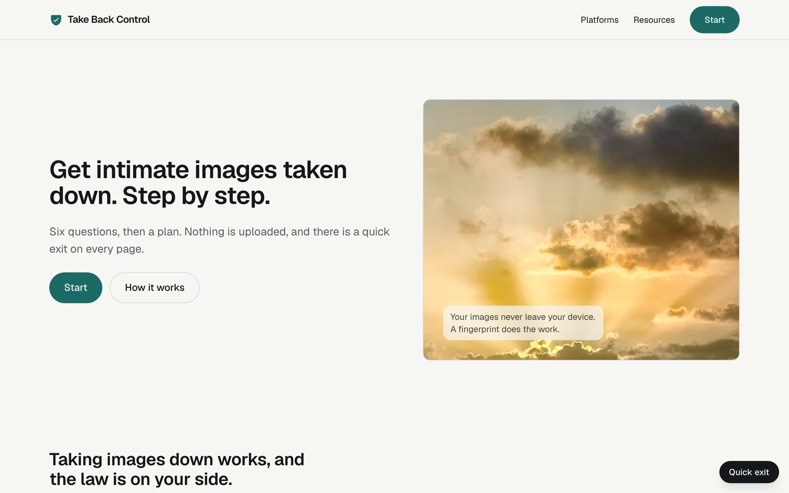
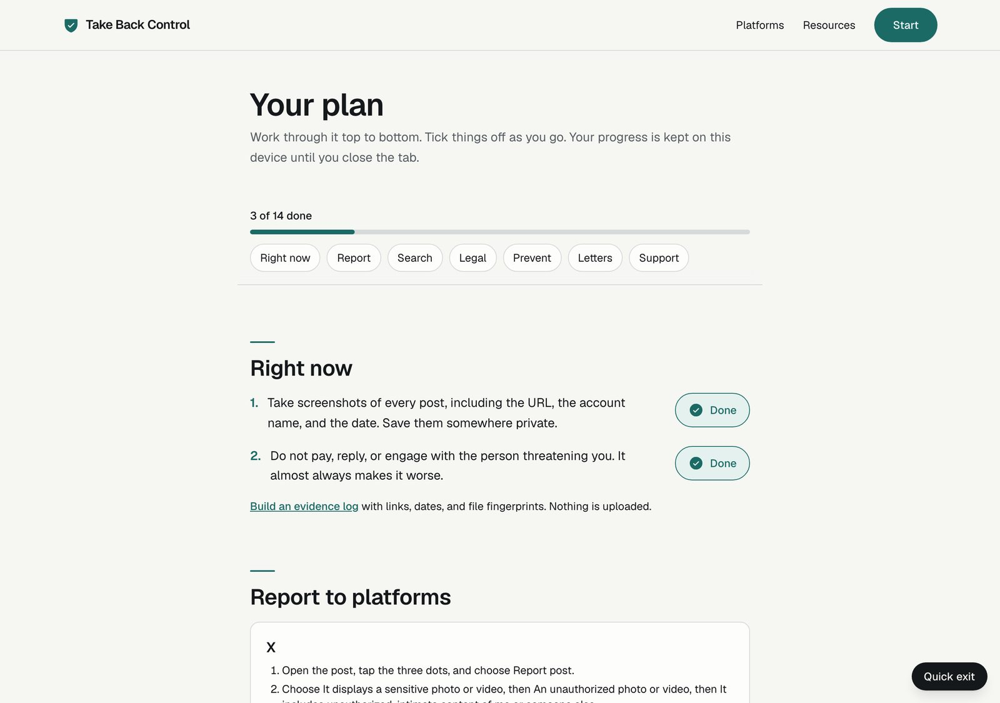
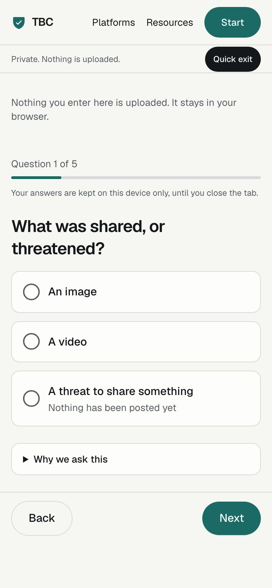

# Take Back Control

[](https://github.com/ContextJet-ai/take-back-control/actions/workflows/ci.yml)


Free, privacy-first guided help for anyone whose intimate images were shared, or threatened to be shared, without their consent. Six questions turn into a checklist the person can tick off: what to record now, exactly how to report on each platform, how to remove search results, the legal route where they live, prefilled removal letters, and a route to [StopNCII](https://stopncii.org/) (adults) or [Take It Down](https://takeitdown.ncmec.org/) (under 18).

**Nothing a person enters is uploaded.** There are no accounts, no database, no analytics, and no API calls. The site needs no keys and no environment variables to build or run.

| Home | Your plan | On a phone |
|---|---|---|
|  |  |  |

## Contents

- [What it does](#what-it-does)
- [Principles](#principles)
- [Quick start](#quick-start)
- [Scripts](#scripts)
- [Project structure](#project-structure)
- [Countries and platforms](#countries-and-platforms)
- [Documentation](#documentation)
- [Accessibility](#accessibility)
- [Privacy and security](#privacy-and-security)
- [Images and credits](#images-and-credits)
- [Roadmap](#roadmap)
- [Important notices](#important-notices)
- [Licence](#licence)

## What it does

1. **Asks six questions** (what was shared, whether it is posted, where, who took it, whether anyone is under 18, which country) and explains why each is asked.
2. **Builds a plan** as a checklist with live progress and jump links. Progress lives in the browser tab only.
3. **Guides reporting** on nine platforms plus any other website, with steps, expected response times and what to do if ignored. Also Google and Bing removal.
4. **Gives the legal levers** for the person's country, with the date each was last checked, and a **ready-to-send letter** in the right legal form, opened in their own email app.
5. **Protects under-18s** with a separate path: sextortion steps, a plain warning never to forward or save the image, Take It Down first, never StopNCII.
6. **Builds an evidence log** in the browser: links, dates, a statement, and a SHA-256 fingerprint of each file, with the files themselves never read by a server.
7. **Gets out of the way**: a Quick exit on every page (also Escape twice) that wipes everything and leaves.

## Principles

- **Privacy by construction.** The site holds no personal data, so there is nothing to leak, subpoena or breach. See [docs/PRIVACY-AND-SECURITY.md](docs/PRIVACY-AND-SECURITY.md).
- **Safe for the person using it.** Designed for someone in distress, possibly on a shared phone, in a hurry.
- **Honest.** Every legal and platform item shows when it was checked. No invented statistics. No claims of endorsement.
- **Easy to adopt.** A static-friendly Next.js site; guidance lives in data files that non-developers can edit.

## Quick start

Requires Node 20 or newer. Nothing else.

```bash
git clone https://github.com/ContextJet-ai/take-back-control.git
cd take-back-control
npm install
npm run dev        # http://localhost:3000
```

## Scripts

| Command | What it does |
|---|---|
| `npm run dev` | Development server with hot reload |
| `npm run build` | Production build |
| `npm start` | Serve the production build |
| `npm test` | Unit tests (Vitest) |
| `npm run e2e` | End-to-end and accessibility tests (Playwright, builds and serves a production bundle) |
| `npm run generate:images` | Regenerate the illustrations. Needs an OpenAI key. Maintainers only. See [Images](#images-and-credits) |

CI runs lint, types, unit tests and the end-to-end suite on every push.

## Project structure

```
app/                    routes: / /start /plan /platforms /resources /evidence /about /privacy
components/wizard/      the questions and the plan checklist
components/landing/     home page sections
content/                platforms, resources, legal levers, letter templates (edit here)
lib/                    plan builder, letter renderer, session state, progress, evidence log
tests/  e2e/            unit tests and Playwright tests
docs/                   guides, design history, screenshots
scripts/                image generation (maintainers)
```

## Countries and platforms

| Region | Legal route and letter | Local resources |
|---|---|---|
| United States | TAKE IT DOWN Act removal request (48 hours) | Yes |
| India | IT Rules 2021 Rule 3(2)(b) grievance (24 hours), 1930 and cybercrime.gov.in | Yes |
| European Union | Digital Services Act Article 16 notice | Yes |
| Australia | eSafety Commissioner first, then platforms | Yes |
| United Kingdom | Revenge Porn Helpline first, section 66B | Yes |
| Canada | Criminal Code section 162.1 | Yes |
| Anywhere else | Generic platform letter and global resources | Global |

Platforms: Facebook and Instagram, TikTok, Snapchat, X, Reddit, Discord, Telegram, YouTube, OnlyFans, Google Search, Bing Search, and any other website via its host.

Adding a country takes about an hour: see [docs/ADDING-A-COUNTRY.md](docs/ADDING-A-COUNTRY.md).

## Documentation

- [docs/README.md](docs/README.md) index
- [Architecture](docs/ARCHITECTURE.md)
- [Content guide](docs/CONTENT-GUIDE.md): how to keep guidance accurate
- [Adding a country](docs/ADDING-A-COUNTRY.md)
- [Privacy and security](docs/PRIVACY-AND-SECURITY.md)
- [Deployment](docs/DEPLOYMENT.md)
- [Contributing](CONTRIBUTING.md), [Security policy](SECURITY.md), [Code of conduct](CODE_OF_CONDUCT.md)
- Design history in [docs/superpowers](docs/superpowers): the original spec, plans, a roadmap stress test, and the guided-assistant design

## Accessibility

Automated axe checks run in CI on the main pages in light and dark mode. The interface is mobile first, keyboard operable with visible focus, respects reduced motion, and has a contrast-tested palette. Please report any barrier as an issue.

## Privacy and security

- Answers and checklist progress live in `sessionStorage` for the tab and are wiped by Quick exit.
- The evidence log never sends a file anywhere.
- Strict security headers, including a content security policy, are set in `next.config.ts`.
- A test fails the build if any tracked file contains something shaped like an API key, or if the app reads an environment variable.

## Images and credits

Photographs are public domain or CC0 from Wikimedia Commons. Illustrations were generated once with OpenAI's image API from the prompts in [`scripts/image-prompts.json`](scripts/image-prompts.json). Every image, its source or model and its date is recorded in [`public/LICENSES.md`](public/LICENSES.md), and a test enforces that. The images are committed, so running the site never needs a key. To regenerate:

```bash
OPENAI_API_KEY=your-key npm run generate:images -- --force
```

## Roadmap

Built: wizard, plan checklist, minors path, evidence log, country packs, landing content, imagery.

Designed, not built: a guided assistant, encrypted case storage, URL monitoring. Some ideas are blocked for reasons worth knowing, for example StopNCII offers no API for third parties. See the [roadmap stress test](docs/superpowers/specs/2026-10-06-roadmap-stress-test.md).

More countries and languages are the most valuable contributions. See [CONTRIBUTING.md](CONTRIBUTING.md).

## Important notices

- This is practical guidance, **not legal advice**.
- It is not affiliated with StopNCII, SWGfL, NCMEC, any regulator, or any platform.
- If you are in immediate danger, contact your local emergency number.
- Laws and report forms change. Each item shows its last-checked date. Please open an issue if something is out of date.

## Licence

No open-source licence has been granted yet. The source is public so it can be read, reviewed and audited, but without a licence the default is that all rights are reserved. To use, host or adapt it, please contact the maintainers by opening an issue. A licence decision is pending and will be recorded here.

Photographs and illustrations carry their own terms, recorded in [`public/LICENSES.md`](public/LICENSES.md).
